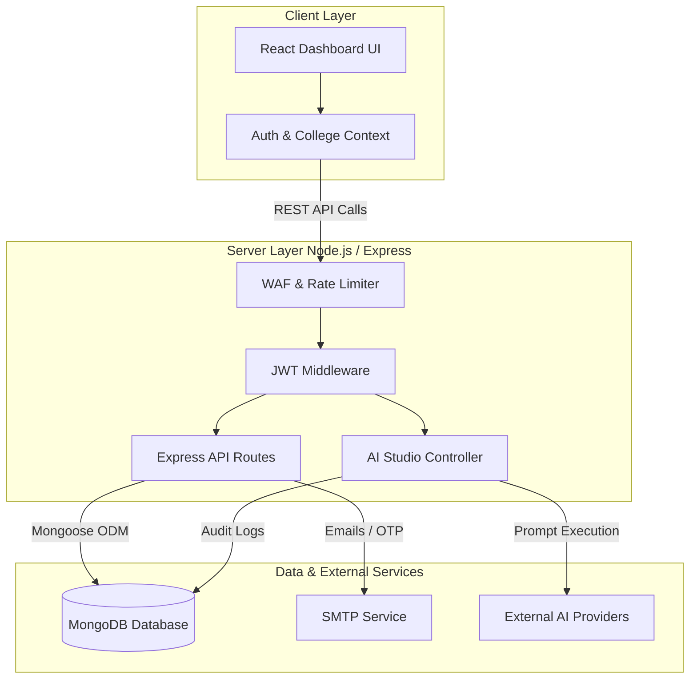
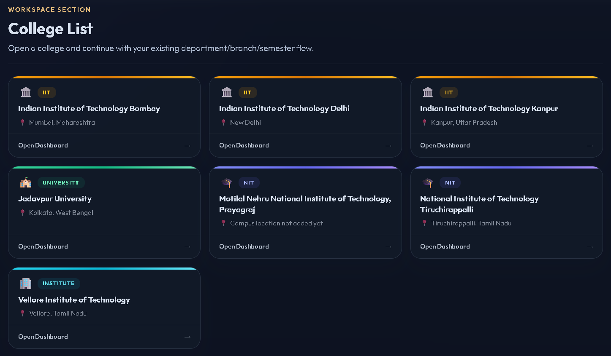
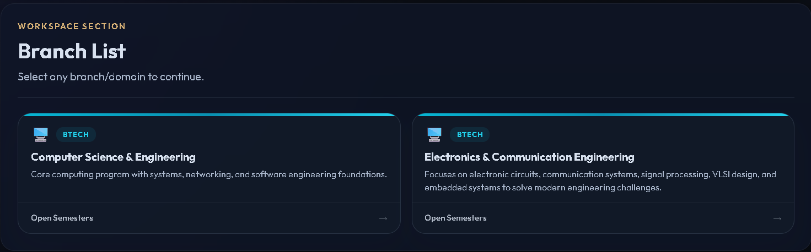
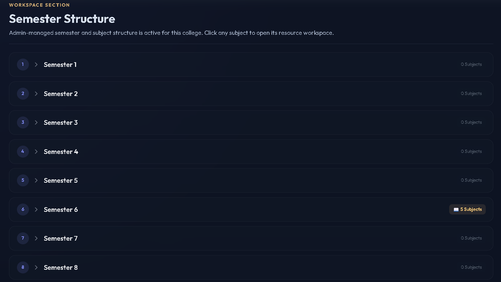
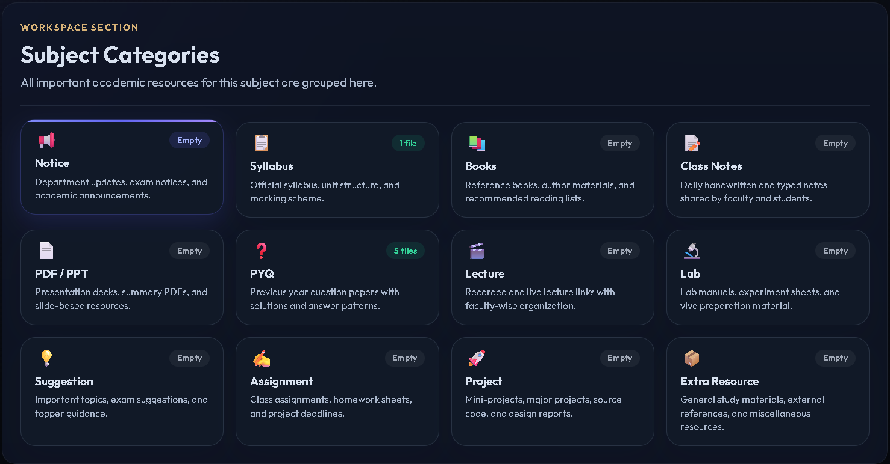
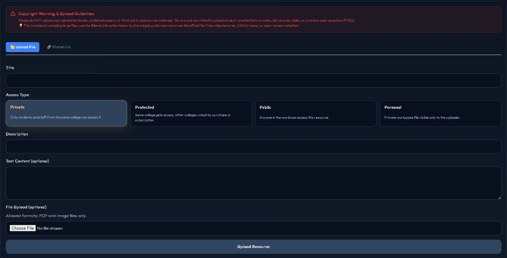

# 🎓 Campus Knowledge Hub

An AI-enabled, secure collegiate academic resource sharing & governance platform. 

Campus Knowledge Hub is an enterprise-grade platform designed for college communities to collaborate, manage study materials, organize courses, and request academic approvals. It features a complete role-based governance model, responsive interfaces, micro-animations, input validation, custom rate-limiting, and an AI-powered assistant grounded in collegiate scopes.

> ⚠️ **Notice to Recruiters & Visitors:** This repository is made public strictly for portfolio evaluation and campus placement purposes. This is a proprietary, closed-source application. Unauthorized copying, hosting, or commercial usage of this code is strictly prohibited and legally protected.

---

## 🔗 Live Application Links

* **Live Demo (Client):** [campus-knowledge-hub-client.vercel.app](https://campus-knowledge-hub-client.vercel.app)
* **Backend API (Server):** [campus-knowledge-hub-1.onrender.com](https://campus-knowledge-hub-1.onrender.com)

---

## 🛠️ Tech Stack & Architecture

This project is built as a highly decoupled Monorepo, utilizing modern architectural patterns:

### 💻 Frontend (Client)
* **Framework:** React.js + Vite for blazing-fast HMR and optimized builds.
* **Styling:** Custom CSS design system with fluid typography, CSS variables, and full Dark/Light mode support.
* **Routing:** React Router DOM with protected hierarchical routes.
* **State Management:** React Context API optimized for minimal re-renders.

### ⚙️ Backend (Server)
* **Runtime:** Node.js environment.
* **Framework:** Express.js RESTful API.
* **Database:** MongoDB & Mongoose ODM with compound indexing for sub-50ms query times.
* **Authentication:** Stateless JWT (JSON Web Tokens) with secure HTTP-only cookie support.
* **Security:** Helmet, custom Web Application Firewall (WAF), express-mongo-sanitize, and strict CORS origin locking.

### 🧠 External Integrations
* **AI Engines:** Multi-provider gateway supporting Gemini 1.5 Flash, GPT-4o, and Claude 3.5 Sonnet.
* **Storage (Cloudflare R2):** High-performance, highly available S3-compatible object storage via Cloudflare R2 for secure academic asset management.
* **Payment Gateway (Razorpay):** Integrated Razorpay Test Mode for securely simulating premium subscription unlocks and marketplace transactions with webhook verification.
* **Mailing:** SMTP transactional emails for OTPs and administration.

---

### 🗺️ System Architecture Diagram

---

## 🚀 Core Features

### 🔐 1. Advanced Security & Access Control
* **Role-Based Access Control (RBAC):** Distinct permission tiers for **Students**, **College Representatives**, and **Administrators**.
* **Password Visibility Toggle:** Premium user experience with eye-icons and SVGs built into Login, Register, and Password Reset screens.
* **Abuse & WAF protection:** Custom Web Application Firewall middleware that blocks directory traversal (`../`), scripting attacks (`<script>`), SQL injections (`UNION SELECT`), and unauthorized CLI tools.
* **Rate Limiting:** Shared Mongo-based or local memory-based rate limiters to prevent authentication brute-force and DDoS attempts.

### 📚 2. Academic Resource & notice Hub
* **Syllabus & Material Governance:** Organizes content logically by College ➔ Program ➔ Branch ➔ Semester ➔ Subject.
* **Asset Moderation:** Secure upload for PDF/PPTs, notes, books, PYQs (Previous Year Questions), and lecture links.
* **Notice Workflow:** Representative announcements targeted globally or restricted to specific college scopes.

### 🤖 3. AI Academic Studio
* **Multi-Provider AI Integration:** Supports OpenAI (GPT-4o-mini), Google Gemini (Gemini 1.5 Flash), and Anthropic (Claude 3.5 Sonnet) chat engines.
* **Academic Grounding:** Scopes queries strictly to college subjects and course descriptions to prevent hallucinations.
* **Chat Memory:** Persists thread contexts across sessions with responsive UI animations.

### ⚙️ 4. Enterprise Audit Trails & Governance
* **Immutable Logs:** Fully-audited actions for user creation, college approvals, notice publishing, and document deletions.
* **Anti-Theft Measures:** Proprietary Domain Origin Locking and strict environment validation prevents unauthorized deployment of this software.
* **Content Moderation:** Built-in reporting system allowing representatives to dismiss or act upon flagged materials.

---

## 📸 Platform Previews

Here is a look at the different sections of the application, showcasing the responsive design and core user interfaces:

### Academic Workspaces

### Resource Management

---

## 📝 Documentations

For detailed descriptions of database models, transaction consistency, and user privilege tables, please refer to:
* **[WIKI.md](./WIKI.md)**: Main developer and security control document.
* **[docs/architecture.md](./docs/architecture.md)**: Details regarding routing, validation, and data persistence models.
