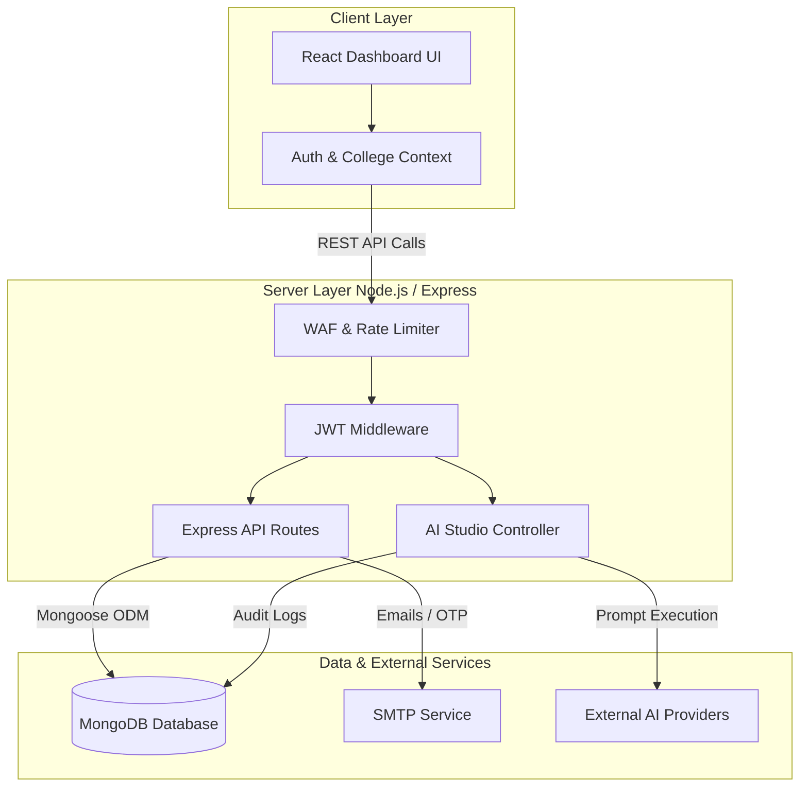

# 🎓 Campus Knowledge Hub

An AI-enabled, secure collegiate academic resource sharing & governance platform. 

Campus Knowledge Hub is designed for college communities to collaborate, manage study materials, organize courses, and request academic approvals. It features a complete role-based governance model, responsive interfaces, micro-animations, input validation, custom rate-limiting, and an AI-powered assistant grounded in collegiate scopes.

---

## 🔗 Live Application Links

* **Live Demo (Client):** [campus-knowledge-hub-client.vercel.app](https://campus-knowledge-hub-client.vercel.app)
* **Backend API (Server):** [campus-knowledge-hub-1.onrender.com](https://campus-knowledge-hub-1.onrender.com)

---

## 🏗️ Project Structure

This project is structured as a monorepo containing:
* **`client/`**: React + Vite frontend styled with responsive CSS tokens, featuring light/dark mode and a secure password visibility toggle.
* **`server/`**: Node.js + Express backend, powered by MongoDB (Mongoose) with transactional integrity.
* **`docs/`**: Detailed project documentation including WAF configurations, secret policy, and architecture design maps.

### Architecture Diagram



---

## 🚀 Core Features

### 🔐 1. Advanced Security & Access Control
* **Role-Based Access Control (RBAC):** Distinct permission tiers for **Students**, **College Representatives**, and **Administrators**.
* **Password Visibility Toggle:** Premium user experience with eye-icons and SVGs built into Login, Register, and Password Reset screens.
* **Abuse & WAF protection:** Custom Web Application Firewall middleware that blocks directory traversal (`../`), scripting attacks (`<script>`), SQL injections (`UNION SELECT`), and unauthorized CLI tools.
* **Rate Limiting:** Shared Mongo-based or local memory-based rate limiters to prevent authentication brute-force and DDoS attempts.

### 📚 2. Academic Resource & notice Hub
* **Syllabus & Material Governance:** Organizes content logically by College ➔ Program ➔ Branch ➔ Semester ➔ Subject.
* **Asset Moderation:** Secure upload for PDF/PPTs, notes, books, PYQs (Previous Year Questions), and lecture links.
* **Notice Workflow:** Representative announcements targeted globally or restricted to specific college scopes.

### 🤖 3. AI Academic Studio
* **Multi-Provider AI Integration:** Supports OpenAI (GPT-4o-mini), Google Gemini (Gemini 1.5 Flash), and Anthropic (Claude 3.5 Sonnet) chat engines.
* **Academic Grounding:** Scopes queries strictly to college subjects and course descriptions to prevent hallucinations.
* **Chat Memory:** Persists thread contexts across sessions with responsive UI animations.

### ⚙️ 4. Enterprise Audit Trails
* **Security Logs:** Fully-audited actions for user creation, college approvals, notice publishing, and document deletions.

---

## 🛠️ Local Installation & Setup

Follow these steps to clone, configure, and run the project locally.

### Prerequisites
* [Node.js](https://nodejs.org/) (v18 or higher recommended)
* [MongoDB](https://www.mongodb.com/try/download/community) (either local installation or a MongoDB Atlas cloud URI)

---

### Step 1: Clone the Repository
```bash
git clone https://github.com/your-username/campus-knowledge-hub.git
cd campus-knowledge-hub
```

---

### Step 2: Configure Environment Variables

#### Backend Server Configuration (`server/`)
Create a `.env` file inside the `server/` directory and configure it as follows:

```env
# Server settings
PORT=5000
NODE_ENV=development
TRUST_PROXY=1

# MongoDB Configuration
MONGODB_URI=mongodb://localhost:27017/campus-knowledge-hub

# Authentication secrets
JWT_SECRET=your-secure-jwt-secret-key
AUTH_COOKIE_NAME=campus_auth
AUTH_TOKEN_IN_COOKIE=true
COOKIE_SAMESITE=lax
COOKIE_SECURE=false

# SMTP Mail settings (for OTP and Admin notifications)
SMTP_HOST=smtp.mailtrap.io
SMTP_PORT=2525
SMTP_SECURE=false
SMTP_USER=your-smtp-username
SMTP_PASS=your-smtp-password
SMTP_FROM=no-reply@campus-knowledge-hub.local
ADMIN_NOTIFICATION_EMAILS=admin@college.edu

# AI Integration APIs (configure at least one)
AI_PROVIDER=gemini
GEMINI_API_KEY=your-gemini-api-key
GEMINI_MODEL=gemini-1.5-flash
# OPENAI_API_KEY=your-openai-api-key
# ANTHROPIC_API_KEY=your-anthropic-api-key

# Security Settings
ABUSE_PROTECTION_ENABLED=true
ABUSE_REQUIRE_USER_AGENT=true
MALWARE_SCAN_MODE=off
```

#### Frontend Client Configuration (`client/`)
Create a `.env` file inside the `client/` directory:

```env
VITE_API_URL=http://localhost:5000/api
```

---

### Step 3: Install & Start Backend (Server)
In a new terminal window:
```bash
cd server
npm install
npm run dev
```
The server will start on `http://localhost:5000` (API endpoint: `http://localhost:5000/api`).

---

### Step 4: Install & Start Frontend (Client)
In a second terminal window:
```bash
cd client
npm install
npm run dev
```
The client will compile and serve on `http://localhost:5173`. Open your browser to begin testing.

---

## 🧪 Running Tests
The backend contains comprehensive unit and integration tests covering rate limiters, validation, and lifecycle controls.
To run the server test suite:
```bash
cd server
npm run test
```

---

## 📝 Documentations

For detailed descriptions of database models, transaction consistency, and user privilege tables, please refer to:
* **[WIKI.md](./WIKI.md)**: Main developer and security control document.
* **[docs/architecture.md](./docs/architecture.md)**: Details regarding routing, validation, and data persistence models.
