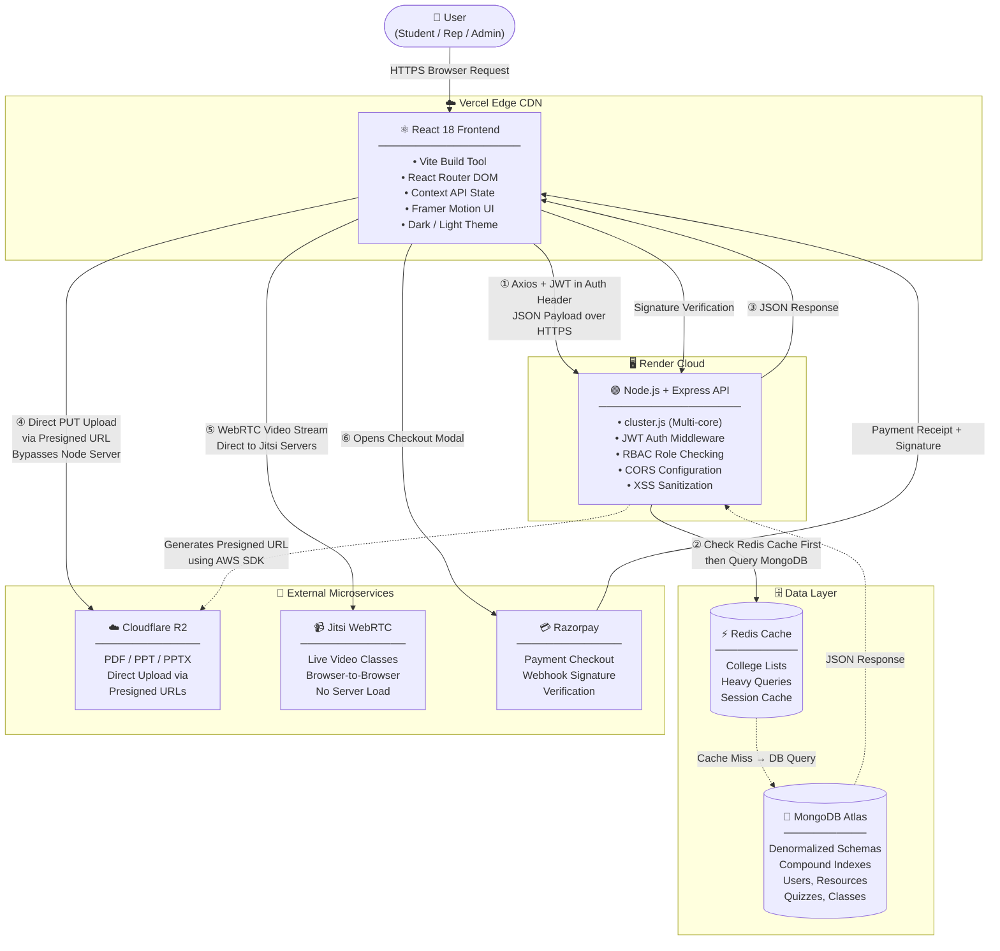

# Campus Knowledge Hub 🎓


**Campus Knowledge Hub** is a multi-tenant, SaaS-based educational networking platform designed to centralize academic resources, enable real-time student communication, and foster college-specific ecosystems. 

It serves as a comprehensive bridge between students and college administrations, offering verified resources, gamified quizzes, AI assistance, and scalable real-time chat communities.

---

## 🔗 Live Application Links

* **Live Demo (Client):** [campus-knowledge-hub-client.vercel.app](https://campus-knowledge-hub-client.vercel.app)
* **Backend API (Server):** [campus-knowledge-hub-1.onrender.com](https://campus-knowledge-hub-1.onrender.com)

---

## 📚 Project Documentation

To understand the architecture, business logic, and database schemas powering this platform, please refer to the comprehensive engineering documentation:

- 📄 **[Product Requirements Document (PRD)](./docs/PRD.md)** - Explains the core problems solved, target audience, and key features.
- 🏗️ **[Technical Requirements & Architecture (TRD)](./docs/TRD.md)** - Details the tech stack, caching mechanisms, security compliance, and third-party integrations.
- 🗄️ **[Database Schema & Relations](./docs/Database_Schema.md)** - Contains the NoSQL schema design, role models, and Mermaid ERD diagrams.
- 🔄 **[App Flow & User Journeys](./docs/App_Flow.md)** - Maps out the step-by-step user experience from authentication to Razorpay checkout.
- 📅 **[Implementation Plan & Agile Phases](./docs/Implementation_Plan.md)** - Breaks down the development lifecycle into 7 actionable sprints.

---

## 🚀 Key Features

*   **Role-Based Access Control**: Separate workflows for Students, College Representatives, and Super Admins.
*   **College-Specific Resource Silos**: Students only see resources (Notes, PYQs, Assignments) specifically mapped to their College, Program, and Branch.
*   **Real-Time Community Chat**: Discord-style chat groups with Emoji Reactions, Join Codes, and Admin "Broadcast" mode.
*   **Dynamic Monetization**: Group creators can purchase extra member capacity dynamically via Razorpay.
*   **AI Integration**: Built-in AI Studio for instant query resolution.
*   **Gamified Quizzes**: Subject-level assessments with real-time scoring and analytics.

---

## 🛠️ Tech Stack

**Frontend:**
*   React 18 (Vite)
*   React Router v7
*   Tailwind CSS / Custom Glassmorphic UI

**Backend:**
*   Node.js / Express.js
*   MongoDB / Mongoose
*   Custom In-Memory Caching Middleware

**Integrations:**
*   Razorpay (Payments)
*   Google Gemini / OpenAI (AI Studio)

---

## 🏗️ System Architecture


```mermaid
flowchart TD
    User(["👤 User\n(Student / Rep / Admin)"])

    subgraph VERCEL["☁️ Vercel Edge CDN"]
        FE["⚛️ React 18 Frontend\n───────────────────\n• Vite Build Tool\n• React Router DOM\n• Context API State\n• Framer Motion UI\n• Dark / Light Theme"]
    end

    subgraph RENDER["🖥️ Render Cloud"]
        API["🟢 Node.js + Express API\n───────────────────\n• cluster.js (Multi-core)\n• JWT Auth Middleware\n• RBAC Role Checking\n• CORS Configuration\n• XSS Sanitization"]
    end

    subgraph DATA["🗄️ Data Layer"]
        MONGO[("🍃 MongoDB Atlas\n───────────\nDenormalized Schemas\nCompound Indexes\nUsers, Resources\nQuizzes, Classes")]
        REDIS[("⚡ Redis Cache\n───────────\nCollege Lists\nHeavy Queries\nSession Cache")]
    end

    subgraph EXTERNAL["🔌 External Microservices"]
        R2["☁️ Cloudflare R2\n──────────────\nPDF / PPT / PPTX\nDirect Upload via\nPresigned URLs"]
        JITSI["📹 Jitsi WebRTC\n──────────────\nLive Video Classes\nBrowser-to-Browser\nNo Server Load"]
        RAZORPAY["💳 Razorpay\n──────────────\nPayment Checkout\nWebhook Signature\nVerification"]
    end

    User -->|"HTTPS Browser Request"| FE
    FE -->|"① Axios + JWT in Auth Header\n    JSON Payload over HTTPS"| API
    API -->|"② Check Redis Cache First\n    then Query MongoDB"| REDIS
    REDIS -.->|"Cache Miss → DB Query"| MONGO
    MONGO -.->|"JSON Response"| API
    API -->|"③ JSON Response"| FE
    FE -->|"④ Direct PUT Upload\n    via Presigned URL\n    Bypasses Node Server"| R2
    API -.->|"Generates Presigned URL\nusing AWS SDK"| R2
    FE -->|"⑤ WebRTC Video Stream\n    Direct to Jitsi Servers"| JITSI
    FE -->|"⑥ Opens Checkout Modal"| RAZORPAY
    RAZORPAY -->|"Payment Receipt + Signature"| FE
    FE -->|"Signature Verification"| API
```

### The 6 Data Flow Arrows Explained

| Arrow | From → To | What it does |
|-------|-----------|--------------|
| **①** | Frontend → Backend | JWT-authenticated JSON request via Axios over HTTPS |
| **②** | Backend → Database | Hits Redis first, falls back to MongoDB on cache miss |
| **③** | Backend → Frontend | Returns JSON response to the React UI |
| **④** | Frontend → Cloudflare R2 | **Bypasses backend entirely.** Direct file upload via Presigned URL |
| **⑤** | Frontend → Jitsi | **Bypasses backend entirely.** Direct WebRTC video stream |
| **⑥** | Frontend → Razorpay → Backend | Checkout modal → payment receipt → backend signature verification |

---

## 💻 Local Development Setup

### 1. Clone the repository
```bash
git clone https://github.com/yourusername/campus-knowledge-hub.git
cd campus-knowledge-hub
```

### 2. Setup Backend
```bash
cd server
npm install
```
Create a `.env` file in the `server` directory:
```env
PORT=5000
MONGO_URI=your_mongodb_connection_string
JWT_SECRET=your_super_secret_key
RAZORPAY_KEY_ID=your_razorpay_key
RAZORPAY_KEY_SECRET=your_razorpay_secret
AI_API_KEY=your_gemini_or_openai_key
```
Start the backend server:
```bash
npm run dev
```

### 3. Setup Frontend
```bash
cd client
npm install
```
Create a `.env` file in the `client` directory:
```env
VITE_API_URL=http://localhost:5000/api
```
Start the frontend dev server:
```bash
npm run dev
```

---

## 📄 License
This project is proprietary and confidential. All rights are reserved by Shib Chandan Mistry. Unauthorized copying, modification, or distribution is strictly prohibited. See the [LICENSE](./LICENSE) file for more details.
