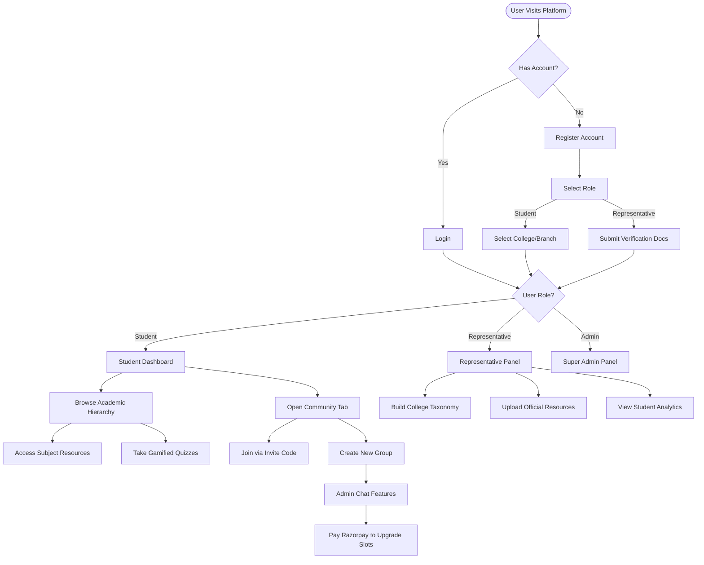

# Application Flow & User Journeys

## High-Level Application Flowchart

## 1. Authentication & Onboarding Flow
1. **Registration/Login**: User enters email and password.
2. **Role Selection**: User chooses between `Student` and `College Representative`. (Admins are created manually via DB/Scripts).
3. **Student Verification**:
   - Students must select their College from an autocomplete dropdown.
   - If the college exists, they proceed to select their Program and Branch.
   - The backend validates the combination. Upon success, they are navigated to their tailored Dashboard.
4. **Representative Verification**:
   - Representatives submit verification documents (handled offline/via Super Admin panel).
   - Once verified, they gain access to the Representative Panel to manage their College's structure.

## 2. Student Dashboard Flow
1. **Home (Dashboard)**: Displays the specific Program the student is enrolled in (e.g., B.Tech).
2. **Branch Selection**: Clicking the Program routes to the specific Branch (e.g., CSE).
3. **Semester View**: Student sees grid of Semesters (1 to 8).
4. **Subject View**: Clicking a Semester displays all Subjects taught in that term.
5. **Resource View**: Inside a Subject, students see categories: `Syllabus`, `Notes`, `PYQs`, `Assignments`. They can download PDFs or view embedded content.

## 3. Community Chat Flow
1. **Joining/Creating**: 
   - User clicks `Community` in the sidebar.
   - User can click `+ Create` to instantly spin up a new chat group. This generates an 8-character invite code.
   - Alternatively, user clicks `Join Link` and enters an invite code provided by a peer.
2. **Chatting**:
   - User selects an Active Group from the left sidebar.
   - Real-time messages populate the main window.
   - User can type messages or hover over existing messages to add Emoji Reactions.
3. **Admin Controls**:
   - Group creator clicks the ⚙️ icon.
   - Can view members, restrict messaging to "Admins Only" (Broadcast Mode), transfer ownership, or Delete the group.
   - If the group is full (256/256), the creator clicks `⚡ Upgrade Capacity` to purchase extra slots via Razorpay.

## 4. Academic Quiz Flow
1. **Discovery**: Student navigates to `Quizzes` in the sidebar or inside a specific Subject.
2. **Execution**: Student takes a gamified MCQ quiz. Timer counts down.
3. **Submission**: Results are instantly calculated and stored.
4. **Analytics**: Student sees their score. College Representatives view aggregate analytics in their Panel.

## 5. College Representative Management Flow
1. **Login**: Representative logs in and accesses the `Representative Panel`.
2. **Structure Management**: Representative can iteratively create:
   - Programs -> Branches -> Semesters -> Subjects.
3. **Resource Upload**: Rep uploads official Syllabus and Assignment files scoped explicitly to their college.

## 6. Payment & Monetization Flow
1. **Initiation**: User clicks a premium action (e.g., Upgrade Group Capacity).
2. **Order Creation**: Frontend requests an Order ID from the backend (`/payments/create-order`).
3. **Checkout**: Backend generates a Razorpay Order. Frontend opens the Razorpay UI overlay.
4. **Processing**: User completes transaction (UPI/Card).
5. **Verification**: Razorpay fires a success callback to the frontend. Frontend sends the payment signature to backend (`/payments/verify`).
6. **Fulfillment**: Backend verifies the HMAC signature. If valid, the database is updated (e.g., `group.maxCapacity += 100`) and success is returned to the user.
