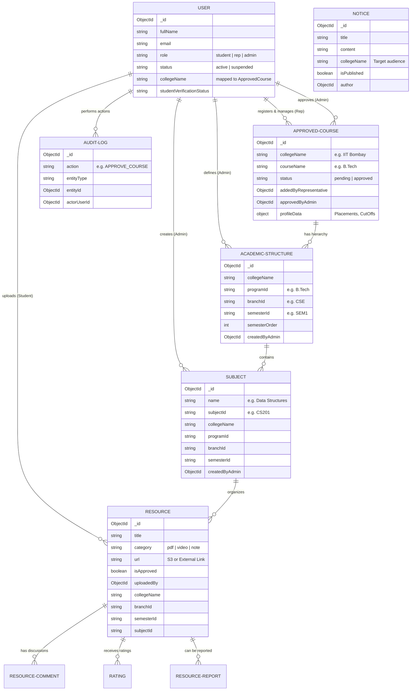

# Core Database Schema Architecture

Here is the Entity Relationship Diagram (ERD) mapping out the core database collections powering the Campus Knowledge Hub platform. This diagram visualizes how users, academic structures, and content are deeply intertwined.

### Key Relationships
- **The Backbone:** `ApprovedCourse` acts as the root for a college. The `AcademicStructure` builds the specific tree under it (Programs > Branches > Semesters), and `Subject` sits precisely at the leaf of that tree.
- **Resources:** Every `Resource` is rigidly tied to a specific node in that academic tree (College -> Branch -> Semester -> Subject) so that it routes perfectly to the correct students.
- **Access Control:** `User` roles govern access to these structures. Representatives manage the `ApprovedCourse` metadata, Admins govern the `AcademicStructure` and `Subjects`, and Students supply the `Resources`.

> [!TIP]
> This represents the core data model. I omitted the auxiliary tables (Quizzes, Assignments, Payments, Plagiarism) from the diagram to keep it readable, but they map to these core entities in a similar fashion.
