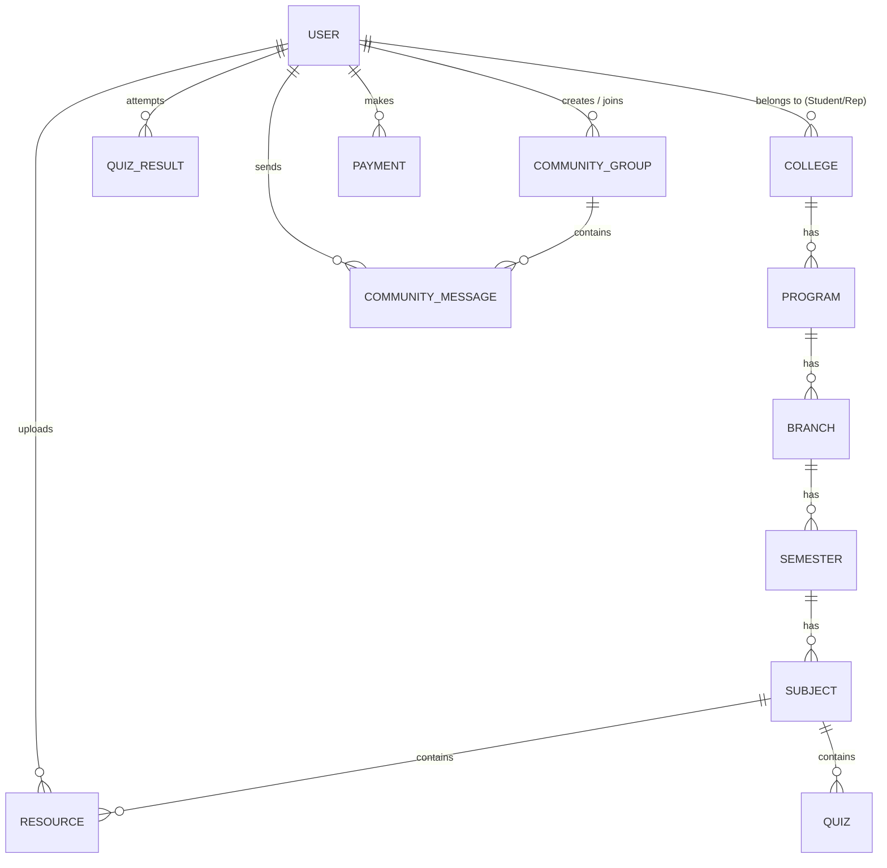
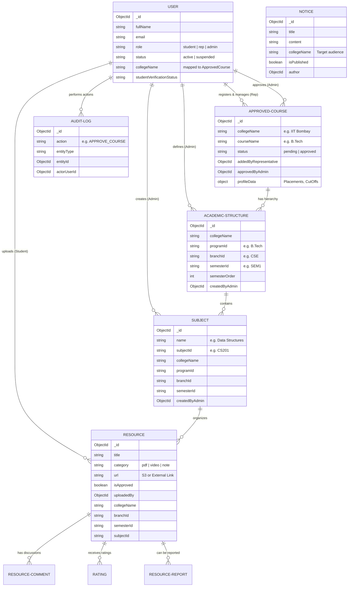

# Database Schema & Relations

The platform uses MongoDB with a highly relational NoSQL schema design. Mongoose is used as the ODM.

## Core Models

### 1. User (`users`)
Manages authentication, roles, and college association.
- `fullName`, `email`, `password`
- `role`: Enum `['student', 'representative', 'admin']`
- `collegeName`, `collegeId`: Associates student/representative with a College.
- `collegeBranch`, `collegeProgram`: Specific academic path for Students.

### 2. College Taxonomy
A strictly hierarchical set of models.
- **College (`colleges`)**: Root entity. `name`, `address`, `establishedYear`.
- **Program (`programs`)**: e.g., B.Tech. Refers to `College`.
- **Branch (`branches`)**: e.g., Computer Science. Refers to `Program`.
- **Semester (`semesters`)**: Represents academic terms. Refers to `Branch`.
- **Subject (`subjects`)**: Specific courses. Refers to `Semester`.

### 3. Resource (`resources`)
Handles academic materials and uploads.
- `title`, `description`, `type` (Enum: `syllabus`, `notes`, `pyq`, `assignment`).
- `fileUrl`: Link to cloud storage.
- `uploader`: Refers to `User`.
- `accessScope`: Enum `['global', 'college_only', 'private']`.
- `subjectId`: Refers to `Subject`.

### 4. Community Group (`communitygroups`)
Manages real-time chat rooms.
- `name`, `description`.
- `inviteCode`: Unique 8-char string.
- `createdBy`: Refers to `User` (Admin of the group).
- `members`: Array of `User` references.
- `maxCapacity`: Integer (default 256, dynamically upgradable).
- `onlyAdminsCanMessage`: Boolean (Broadcast mode).

### 5. Community Message (`communitymessages`)
Stores real-time chat history.
- `groupId`: Refers to `CommunityGroup`.
- `sender`: Refers to `User`.
- `text`: String.
- `reactions`: Array of objects `{ emoji: String, users: [User references] }`.

### 6. Quiz (`quizzes`) & Result (`quizresults`)
Gamified assessment models.
- **Quiz**: `title`, `subjectId`, `questions` (Array of question objects with `options` and `correctAnswer`).
- **QuizResult**: `quizId`, `studentId`, `score`, `totalQuestions`, `passed`.

### 7. Payment (`payments`)
Manages Razorpay transactions for marketplace and capacity upgrades.
- `user`: Refers to `User`.
- `razorpayOrderId`, `razorpayPaymentId`, `razorpaySignature`.
- `amount`, `currency`, `status`.
- `paymentType`: Enum `['premium_notes', 'course_enrollment', 'group_capacity']`.
- `targetId`: Dynamic reference to the purchased entity (e.g., `CommunityGroup` ID).

## High-Level Schema Relationships (ERD Concept)

## Detailed Core Architecture Breakdown

Here is the highly-detailed mapping of the core academic engine collections (Governance, Structure, and Content):

