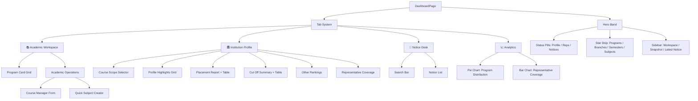

# Dashboard Page — Full Breakdown

> **File**: [DashboardPage.jsx](file:///C:/Users/shib%20chandan%20mistry/Documents/campus-knowledge-hub/client/src/pages/DashboardPage.jsx) — **1,457 lines**

---

## Architecture Overview



---

## Data Sources (5 API calls on mount)

| # | API Endpoint | Triggers On | State Variable | Purpose |
|---|---|---|---|---|
| 1 | `GET /governance/college-profile` | `selectedCollege`, `selectedProfileCourse` | `profile` | College profile (rankings, placements, cut-offs, location) |
| 2 | `GET /governance/approved-courses` | `selectedCollege` | `approvedCourses` | Approved course entries for the college |
| 3 | `GET /notices` | `selectedCollege` | `notices` | Latest 5 notices for the college |
| 4 | `GET /academic/structures` | `selectedCollege` | `structures` | Full program → branch → semester → subject tree |
| 5 | `POST /academic/subjects` | User action | `lastCreatedSubject` | Quick subject creator (write operation) |

---

## State Variables (18 total)

### Core Data
| Variable | Type | Source |
|---|---|---|
| `profile` | Object \| null | API: college profile |
| `approvedCourses` | Array | API: approved courses |
| `notices` | Array | API: notices (max 5) |
| `structures` | Array | API: grouped academic structures |

### UI State
| Variable | Type | Default | Purpose |
|---|---|---|---|
| `activeTab` | String | `"workspace"` | Current tab: workspace / profile / notices / analytics |
| `programSearch` | String | `""` | Search filter for program cards |
| `noticeSearch` | String | `""` | Search filter for notices |
| `selectedProfileCourse` | String | `"overall"` | Which course scope to show profile for |
| `activeRepresentativeKey` | String | `""` | Expanded representative in directory |
| `loadingProfile` | Boolean | `false` | Profile loading spinner |
| `profileError` | String | `""` | Profile load error message |

### Quick Subject Creator
| Variable | Type | Purpose |
|---|---|---|
| `quickSubjectForm` | Object | `{programId, branchId, semesterId, subjectName, subjectId}` |
| `quickCreateBusy` | Boolean | Submit loading state |
| `quickCreateMessage` | String | Success/error message |
| `lastCreatedSubject` | Object \| null | Shows category chips after creation |

### Course Manager
| Variable | Type | Purpose |
|---|---|---|
| `courseForm` | Object | `{courseName}` |
| `courseBusy` | Boolean | Submit loading state |

---

## Computed Data (useMemo — 10 memos)

| Memo | Depends On | Output |
|---|---|---|
| `programCards` | `structures`, `approvedCourses` | Unified program list (DB structures > approved courses > static fallback) |
| `filteredPrograms` | `programCards`, `programSearch` | Search-filtered program list |
| `filteredNotices` | `notices`, `noticeSearch` | Search-filtered notice list |
| `representativeDirectory` | `approvedCourses` | Grouped reps with their course assignments |
| `totalBranches` | `structures` | Sum of all branches across programs |
| `totalSemesters` | `structures` | Sum of all semesters across all branches |
| `totalSubjects` | `structures` | Sum of all subjects across all semesters |
| `dashboardStats` | Multiple | 4-tile stat strip data |
| `heroStatusItems` | `profile`, `notices`, `representativeDirectory` | 3 status pills |
| `profileHighlights` | `profile` | 6 key-value cards (Location, Exams, NIRF, QS, Avg/Highest Package) |
| `academicDistributionData` | `structures`, `approvedCourses` | Pie chart data |
| `representativeCoverageData` | `representativeDirectory` | Bar chart data (top 10 reps) |
| `availablePrograms` | `structures`, `approvedCourses` | Course scope selector chips |

---

## UI Structure — 4 Tabs

### 🔷 Hero Band (Always visible)
Located at [lines 720-813](file:///C:/Users/shib%20chandan%20mistry/Documents/campus-knowledge-hub/client/src/pages/DashboardPage.jsx#L720-L813)

```
┌─────────────────────────────────────┬──────────────────┐
│ Academic Overview                   │ Active Workspace │
│ [College Name]                      │ [shortName]      │
│ [Status Pills: Profile/Reps/Notices]│                  │
│                                     │ Live Snapshot    │
│ ┌─────┬─────┬─────┬─────┐          │ • X courses      │
│ │Progs│Brans│Sems │Subjs│          │ • Y reps         │
│ └─────┴─────┴─────┴─────┘          │ • Z notices      │
│                                     │                  │
│                                     │ Latest Notice    │
│                                     │ [title]          │
└─────────────────────────────────────┴──────────────────┘
```

### 📚 Tab 1: Academic Workspace
Located at [lines 883-1169](file:///C:/Users/shib%20chandan%20mistry/Documents/campus-knowledge-hub/client/src/pages/DashboardPage.jsx#L883-L1169)

- **Program Grid** — Clickable cards linking to `/dashboard/{programId}`
- **Academic Operations** (admin/rep only):
  - **Course Manager** — Add new course (admin: direct, rep: request)
  - **Quick Subject Creator** — Add subjects to existing semester structure
  - After subject creation, shows category chips (Notice, Syllabus, Books, etc.)

### 🏛️ Tab 2: Institution Profile
Located at [lines 1171-1417](file:///C:/Users/shib%20chandan%20mistry/Documents/campus-knowledge-hub/client/src/pages/DashboardPage.jsx#L1171-L1417)

- **Course Scope Selector** — Filter profile by Overall / specific course
- **Highlights Grid** — Location, Entrance Exams, NIRF, QS, Avg Package, Highest Package
- **Placement Report** — Rich text + structured table (branch → avg/highest package)
- **Cut Off Summary** — Rich text + structured table (branch → closing rank)
- **Other Rankings** — Free-text rich content
- **Placement Report URL** — External link button
- **Representative Coverage** — Directory of reps with expandable course lists

### 📢 Tab 3: Notice Desk
Located at [lines 1420-1453](file:///C:/Users/shib%20chandan%20mistry/Documents/campus-knowledge-hub/client/src/pages/DashboardPage.jsx#L1420-L1453)

- Search bar for filtering notices
- List of notice cards (title, college/platform scope, content)

### 📈 Tab 4: Analytics
Located at [lines 850-881](file:///C:/Users/shib%20chandan%20mistry/Documents/campus-knowledge-hub/client/src/pages/DashboardPage.jsx#L850-L881)

- **Pie Chart** — Program distribution by semester density
- **Bar Chart** — Top 10 representatives by courses managed / total semesters

---

## Helper Functions

| Function | Lines | Purpose |
|---|---|---|
| `normalizeProgramKey()` | [14-20](file:///C:/Users/shib%20chandan%20mistry/Documents/campus-knowledge-hub/client/src/pages/DashboardPage.jsx#L14-L20) | Slugifies program names for IDs/routes |
| `slugify()` | [22-28](file:///C:/Users/shib%20chandan%20mistry/Documents/campus-knowledge-hub/client/src/pages/DashboardPage.jsx#L22-L28) | General-purpose slug generator |
| `renderRichText()` | [30-134](file:///C:/Users/shib%20chandan%20mistry/Documents/campus-knowledge-hub/client/src/pages/DashboardPage.jsx#L30-L134) | Parses markdown-style tables from text and renders as HTML tables |
| `reloadApprovedCourses()` | [179-195](file:///C:/Users/shib%20chandan%20mistry/Documents/campus-knowledge-hub/client/src/pages/DashboardPage.jsx#L179-L195) | Re-fetches approved courses |
| `reloadStructures()` | [197-211](file:///C:/Users/shib%20chandan%20mistry/Documents/campus-knowledge-hub/client/src/pages/DashboardPage.jsx#L197-L211) | Re-fetches academic structures |
| `handleQuickCreateSubject()` | [488-533](file:///C:/Users/shib%20chandan%20mistry/Documents/campus-knowledge-hub/client/src/pages/DashboardPage.jsx#L488-L533) | Creates a subject via API |
| `handleCreateCourse()` | [535-566](file:///C:/Users/shib%20chandan%20mistry/Documents/campus-knowledge-hub/client/src/pages/DashboardPage.jsx#L535-L566) | Creates/requests a course |
| `handleDeleteCourse()` | [568-585](file:///C:/Users/shib%20chandan%20mistry/Documents/campus-knowledge-hub/client/src/pages/DashboardPage.jsx#L568-L585) | Deletes a course (password-protected) |

---

## Role-Based Visibility

| Feature | Student | Representative | Admin |
|---|---|---|---|
| View Hero Band | ✅ | ✅ | ✅ |
| View Program Grid | ✅ | ✅ | ✅ |
| View Profile Tab | ✅ | ✅ | ✅ |
| View Notices | ✅ | ✅ | ✅ |
| View Analytics | ✅ | ✅ | ✅ |
| Course Manager | ❌ | ✅ (request) | ✅ (direct) |
| Quick Subject Creator | ❌ | ✅ | ✅ |
| Delete Course | ❌ | ✅ | ✅ |
